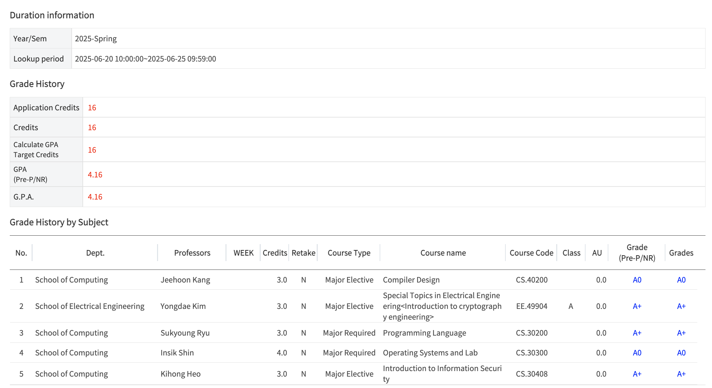

# Jun Song's 2025 Spring

My personal (and also public) archive for 2025 Spring Semester at KAIST.

## GPA - 4.16/4.30

## Link to the course details

My personal best is [CS348](./cs348/).

- [CS320 Programming Language](./cs320)
- [CS330 Operating Systems and Lab](./cs330)
- [CS348 Introduction to Information Security](./cs348)
- [CS420 Compiler Design](./cs420)
- [EE488 Introduction to Cryptography Engineering](./ee488)

## TODOs

- [ ] Upload a retrospect for 2025 Spring