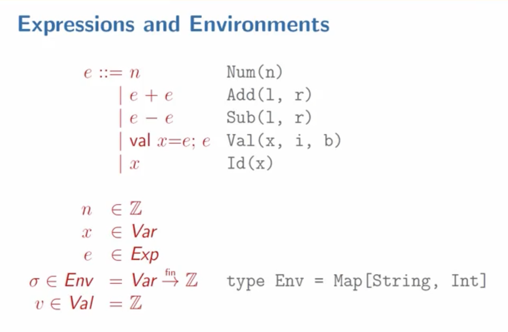

# 0309

## Identifiers

- **identifier** = names. Textbook Ch.7
- parameters/local identifier is consistently renamed -> same function
- if local identifier hides the paramter, diff function
- function paramter & local identifier 
  - introduction = **binding occurence**
  - when we use, it's "**bound occurence**.
  - free identifer: use of an identifer that is not a function parameter or local identifer. -> ERROR

## Arithmetic Expressions with Identifiers

```plaintext
expr ::= num
      | "(" expr "+" expr ")"
      | "(" expr "-" expr ")"
      | "{" "val" id "=" expr ";" expr "}"
      | id
```
- Extend this with two more features

```example
{
    val x = (1 + 2);
    (x + x)
}
```

```example2
x
```
-> Free identifer, so error

```scala
trait Expr
case class Num(n: Int) extends Expr
case class Add(left: Expr, right: Expr) extends Expr
case class Sub(left: Expr, right: Expr) extends Expr
case class Val(x: String, i: Expr, b: Expr) extends Expr
case class Id(x: String) extends Expr
```
-> Scala impl of Abstract Syntax

## Evaluation of VAE

**VAE** => Arithmetic Expression with Val(identifier)

- `interp : Expr => Int` => `interp : (Expr, Env) => Int`
  - Environment (or Symbol Table)
- `type Env = Map[String, Int]`
- In Scala, adding, subtracting to Map doens't change its value, we have to assign.

```scala
def interp(expr: Expr, env: Env): Int = expr match {
    case Num(n) => n
    case Add(l, r) => interp(l) + interp(r)
    case Sub(l, r) => interp(l) - interp(r)
    case Val(x, i, b) => interp(b, env + (x -> interp(i, env)))
    case Id(x) => lookup(x, env)
}

// lookup : (String, Env) => Int
def lookup(name: String, env: Env): Int =
    // env.get(name) match {
    //     case Some(v) => v
    //     case None => error(s"free identifier: $name")
    // }
    env.getOrElse(name, error(s"free identifier: $name"))
```

## Semantics of VAE


- Sigma -> finite mapping from Var to Integer value


- `val x = e_1; e2` can be expressed in mathematics like this way.