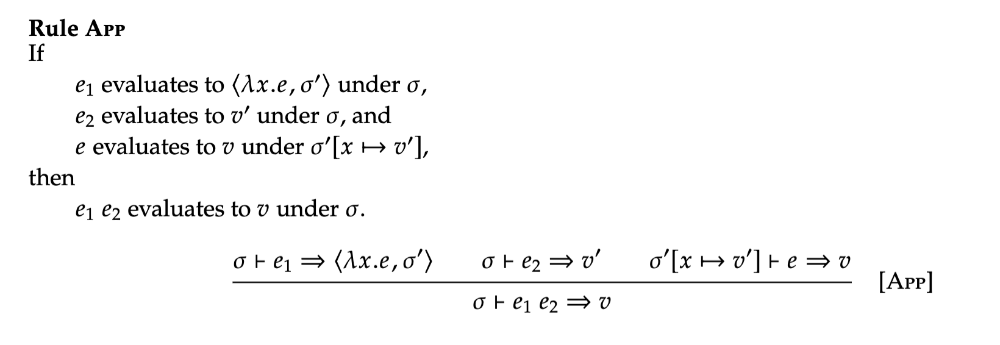
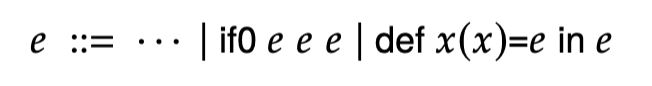

# 0324

- FVAE -> function as a value. `trait Value` has two classes -> `NumV`, `Clov`
  - environment -> when function defined.
  - no more `val` -> `{ val id = expr1; expr2 } == { id => expr2 }(expr1)`
- F1VAE -> environment: should contain small piece of info.

## Let's grow the language: VAE -> FAE

### Concrete Syntax

```
expr ::= num
      | "(" expr "+" expr ")"
      | "(" expr "-" expr ")"
      | id
      | expr "(" expr ")"
      | "{" id "=>" expr "}"
```

### Abstract Syntax

```scala
trait Value
case class NumV(n: Int) extends Value
case class CloV(param: String, body: Expr, env: Env) extends Value

type Env = Map[String, Value]

trait Expr
case class Num(n: Int) extends Expr
case class Add(left: Expr, right: Expr) extends Expr
case class Sub(left: Expr, right: Expr) extends Expr
case class Id(x: String) extends Expr
case class Fun(x: String, b: Expr) extends Expr
case class App(f: Expr, a: Expr) extends Expr
```

#### Interpreter

```scala
def interp(e: Expr, env: Env): Value = e match {
    case Num(n) => NumV(n)
    case Add(l, r) => numVAdd(interp(l, env), interp(r, env))
    case Sub(l, r) => numVSub(interp(l, env), interp(r, env))
    case Id(x) => lookup(x, env)
    case Fun(x, b) => Clov(x, b, env)
    case App(f, a) => interp(f, env) match {
        case CloV(x, b, fenv) => interp(b, fenv + (x -> interp(a, env)))
        case v => error(s"not a closure: $v")
    }
}
```

### Semantics of FAE

```
e ::= n
   | e + e
   | e - e
   | x
   | lambda x.e
   | e e 

v ::= n | < lambda x.e, sigma(env) >
```

- addition, subtraction: each expression must be a **integer**
- function -> must be a **closure**



- most important: interpret App.


## Lambda Calculus

- minimum core of programming language
- we will gonna shrink the language.
  - e.g. val is not necessary
  - e.g.2 also, we don't need **numbers, +, -**.

### LC Grammar

```
expr ::= id
      | expr "(" expr ")"
      | "{" id "=>" expr "}"
```

- Identity function: `{ x => x }`

#### Church numerals

- producing zero: what's zero?
  - we need to encode *zero*.
  - `{ f => { x => x } }`: 
- true: `{ x => { y => x } }`
- false: `{ x => { y => y } }`
- one: `{ f => { x => f(x) } }`
- two: `{ f => { x => f(f(x)) } }`

- Turing machine == lambda calculus! we can write any computable program in lambda calculus.
- All programming languages can be down to lambda calculus

## Recursion

> "Semantics of Recursion"

-> RFAE

### Concrete Syntax

```
expr ::= num
      | "(" expr "+" expr ")"
      | "(" expr "-" expr ")"
      | "(" expr "*" expr ")"
      | id
      | expr "(" expr ")"
      | "{" id "=>" expr "}"
      | "if0" "(" expr ")" "{" expr "}" "else" "{" expr "}"
      | "{" "def" id "(" id ")" "=" expr ";" expr "}"
```

- we DO need conditional expression, because loop should be broken in some how.
- `if0` -> we don't have boolean value.
  - we will say `0` is true, and others are false.
- `def` defines "recursive" function.
- using `val` -> free identifier error.

#### Example: Factorial

```
{
    def fac(n) =
        if0 (n) { 1 } else { ( n * fac((n - 1)) ) };
    fac(10)
}
```

- first `fac` -> binding occurrence, second/third `fac` -> bounding occurrence

### But.. we don't want `def`. Let's make it without `def`.

- pass `fac` as an argument.

```
{
    val facX = { (facY, n) => 
        if0 (n) { 1 } else { ( n * facY(facY, (n - 1)) ) }
    };
    facX(facX, 10)
}
```

- first, `fac` cannot be used inside the function body if we use `val`.
- so we pass the function itself as an argument, then we can use it.

=>

```
{
    val fac = { n => {
        val facX = { (facY, n) => 
            if0 (n) { 1 } else { ( n * facY(facY, (n - 1)) ) }
        };
        facX(facX, n)
    }};
    fac(10)
}
```

### but we only accept single parameter..?

- We can simulate multiple arguments into single argument...

```
{
    val f = { (x, y, z) => (z + (y + x)) };
    f(1, 2, 3)
}
```

```
{
    val f = { x => { y => { z => (z + (y + x)) } } };
    f(1)(2)(3)
}
```

-> curried function

```
{
    val fac = { n => {
        val facX = { facY => { n => 
            if0 (n) { 1 } else { ( n * facY(facY)((n - 1))) }
        }};
        facX(facX)(n)
    }};
    fac(10)
}
```

### Let's make this simple. Eta reduction

- we can simplify `{ n => expr(n) }` to `expr` where `n` is not free in `expr`.

```
{
    val fac = {
        val facX = { facY => { n => 
            if0 (n) { 1 } else { ( n * facY(facY)((n - 1))) }
        }};
        facX(facX)
    };
    fac(10)
}
```

### We don't like `facY(facY)(...)` -> just give the name

```
{
    val fac = {
        val facX = { facY => { 
            val fac = facY(facY);
            // This looks like the original factorial function...
            { n => if0 (n) { 1 } else { ( n * fac((n - 1))) } }
        }};
        facX(facX)
    };
    fac(10)
}
```

-> but this is an infinite loop.
- We call `facX(facX)`, and when `val fac = facY(facY)`, `fac = facX(faxX)(facX)......` => infinite loop! 
- we need to delay the evaluation of `facY(facY)`.\
- we use lambda expression, to freeze the environment.

### Reverse of Eta reduction

```
{
    val fac = {
        val facX = { facY => { 
            val fac = { x => facY(facY)(x) };
            { n => if0 (n) { 1 } else { ( n * fac((n - 1))) } }
        }};
        facX(facX)
    };
    fac(10)
}
```

### Make common part as a library: Make-Recursive

```
{
    val mkRec = { bodyProc => {
        val fX = { fY => {
            val f = { x => fY(fY)(x) };
            bodyProc(f)
        }};
        fX(fX)
    }};
    {
        val fac = mkRec({ fac => {
            n => if0 (n) { 1 } else { ( n * fac((n - 1))) }
        }});
        fac(10)
    }
}
```

## RFAE

```
{
    def fac(n) =
        if0 (n) { 1 } else { ( n * fac((n - 1)) ) };
    fac(10)
}
```

is equal to

```
{
    val fac = mkRec({ fac => {
        n => if0 (n) { 1 } else { ( n * fac((n - 1))) }
    }});
    fac(10)
}
``` 

but also we can use **mutation**(`var`-approach) to implement recursion

```
{
    var fac = 42;
    {
        fac = { n => if0 (n) { 1 } else { n * fac((n - 1)) } };
        fac(10)
    }
}
```

### Concrete Syntax

```
expr ::= num
      | "(" expr "+" expr ")"
      | "(" expr "-" expr ")"
      | "(" expr "*" expr ")"
      | id
      | expr "(" expr ")"
      | "{" id "=>" expr "}"
      | "if0" "(" expr ")" "{" expr "}" "else" "{" expr "}"
      | "{" "def" id "(" id ")" "=" expr ";" expr "}"
```

### Abstract Syntax

```scala
trait Expr
case class Num(n: Int) extends Expr
case class Add(left: Expr, right: Expr) extends Expr
case class Sub(left: Expr, right: Expr) extends Expr
case class Mul(left: Expr, right: Expr) extends Expr
case class Id(x: String) extends Expr
case class Fun(x: String, b: Expr) extends Expr
case class App(f: Expr, a: Expr) extends Expr
case class If0(c: Expr, t: Expr, f: Expr) extends Expr
case class Rec(f: String, x: String, b: Expr, e: Expr) extends Expr
```

```scala
trait Value
case class NumV(n: Int) extends Value
case class CloV(param: String, body: Expr, var env: Env) extends Value

type Env = Map[String, Value]
```

#### Interpreter

```scala
def interp(e: Expr, env: Env): Value = e match {
    case Num(n) => NumV(n)
    case Add(l, r) => numVAdd(interp(l, env), interp(r, env))
    case Sub(l, r) => numVSub(interp(l, env), interp(r, env))
    case Mul(l, r) => numVMul(interp(l, env), interp(r, env))
    case Id(x) => lookup(x, env)
    case Fun(x, b) => Clov(x, b, env)
    case App(f, a) => interp(f, env) match {
        case CloV(x, b, fenv) => interp(b, fenv + (x -> interp(a, env)))
        case v => error(s"not a closure: $v")
    }
    case If0(c, t, f) => interp(c, env) match {
        case NumV(0) => interp(t, env)
        _ => interp(f, env)
    }
    case Rec(f, x, b, e) => 
        val cloV = CloV(x, b, env)
        val nenv = env + (f -> cloV)
        cloV.env = nenv
        interp(e, nenv)
}
```

#### Example

```
{
    def count(n) = 
        if0 (n) { 0 } else { ( 1 + count((n - 1)) ) };
    count(8)
}
```

-> 

```scala
b = RFAE("if0 (n) { 0 } else { ( 1 + count((n - 1)) ) }")
e = RFAE("count(8)") = App("count", NumV(8))
Rec("count", "n", b, e)

val cloV = CloV("n", b, Map())
val nenv = Map("count" -> cloV)
clov = CloV("n", b, Map("count" -> cloV))
```

## Recursion Semantics

- Textbook will be really helpful.



- expressions

### For if0

-> when we interpret conditional -> depending on the value, we interpret **only one branch**!