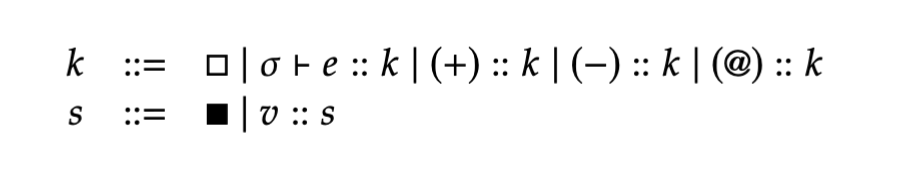

# 0420

## 1-1. Continuations

- functional language hates manual control statements -> continuation is the key
- counting example
- we can use imperative way... like:

```scala
def numOfWordsFromFile(name: String, word: String): Int = {
    var content = ""
    if (cached(name)) {
        content = getCache(name)
    } else {
        if (!exists(name)) {
            return -1
        } else {
            content = read(name)
        }
    }
    return numOfWords(content, word)
}
```

- Let's make our functional programming work:

```scala
{ name => { word =>
    numOfWords(
        if (cached(name)) {
            getCache(name)
        } else {
            if (not(exists(name))) {
                -1 // This is not the desirable return type.
            } else { 
                read(name)
            }
        }
    )(word)
}}
```

- complex solution

```scala
{ name => { word => {
    val content = 
        if (cached(name)) {
            getCache(name)
        } else {
            if (not(exists(name))) {
                -1
            } else { 
                read(name)
            }
        };
    if (content == -1) {
        -1 
    } else {
        numOfWords(content)(word)
    }
}}}
```

- continuation solution!!!
```scala
{ name => { word => {
    vcc k; // cc -> current continuation
    numOfWords(
        if (cached(name)) {
            getCache(name)
        } else {
            if (not(exists(name))) {
                k(-1)
            } else { 
                read(name)
            }
        }
    )(word)
}}}
```

- expression = value or none.
- not a value -> should be evaluated further
  - redex: expression that will be evaluated first
  - continuation: remaining evaluation -> how to continue after the redex is reduced to a value.
  - may not be familiar but will find multiple times!!

### continuation passing style

- no need to return to callers: what to do next is **also passed** as an argument

### FAE in continuation passing style(CPS)

```
expr ::= num
      | "(" expr "+" expr ")"
      | "(" expr "-" expr ")"
      | "{" "val" id "=" expr ";" expr "}"
      | id
      | expr "(" expr ")"
      | "{" id "=>" expr "}"
```

- concrete syntax is same

```scala
type Cont = Value => Value
```

```scala
def interp(e: Expr, env: Env, k: Cont): Value = e match {
    ...
}
```

## 1-2. Continuation Passing Style

```scala
def interp(e: Expr, env: Env, k: Cont): Value = e match {
    case Num(n)     => k(NumV(n))
    case Id(x)      => k(env.getOrElse(x, error(s"free identifier: $x")))
    case Fun(p, b)  => k(CloV(p, b, env))
    case Add(l, r)  => 
        interp(l, env, lv => 
            interp(r, env, rv => 
                k(numVAdd(lv, rv))))
    case Sub(l, r)  => 
        interp(l, env, lv => 
            interp(r, env, rv => 
                k(numVSub(lv, rv))))
    case App(f, a) =>
        interp(f, env, fv =>
            interp(a, env, av => 
                fv match {
                    case CloV(p, b, fenv) =>
                        interp(b, fenv + (p -> av), k)
                    case v => error("not a closure: $v")
                }))
}
```

- App -> f를 먼저 eval하고, 만약 CloV일 때만 a를 eval하면 되지 않을까? -> 직접 해보기
- at first, k -> identity function! (x => x)

## 1-3. Small-Step Operational Semantics

- we learned with Big-Step mostly.



- Num, Fun, Id, Add/Sub, App -> can all be represented as this operational semantics
- also equivalence btw big-step and small-step

## 1-4. First-Class Continuations

new language = KFAE

```
expr ::= num
      | "(" expr "+" expr ")"
      | "(" expr "-" expr ")"
      | "{" "val" id "=" expr ";" expr "}"
      | id
      | expr "(" expr ")"
      | "{" id "=>" expr "}"
      | "{" "vcc" id ";" expr "}"   // ADDED!
```

- e.g. `{ vcc k; (1 + k(2)) }` => `2`
- e.g.2

```
{
    vcc done; // (Identity function)
    {
        vcc esc; // (Call with argument 3)
        done((1 + { vcc k; esc(k) })) // vcc k <= increment by 1
    }(3)
}
```

=> `4`


### Abstract Syntax of KFAE

```scala
trait Expr
case class Num(n: Int) extends Expr
case class Add(left: Expr, right: Expr) extends Expr
case class Sub(left: Expr, right: Expr) extends Expr
case class Id(x: String) extends Expr
case class Fun(x: String, b: Expr) extends Expr
case class App(f: Expr, a: Expr) extends Expr
case class Vcc(x: String, b: Expr) extends Expr
```

```scala
trait Value
case class NumV(n: Int) extends Value
case class CloV(param: String, body: Expr, env: Env) extends Value
case class ContV(proc: Cont) extends Value // b/c it's first-class!
type Cont = Value => Value
```

```scala
def interp(e: Expr, env: Env, k: Cont): Value = e match {
    case Num(n)     => k(NumV(n))
    case Id(x)      => k(env.getOrElse(x, error(s"free identifier: $x")))
    case Fun(p, b)  => k(CloV(p, b, env))
    case Add(l, r)  => 
        interp(l, env, lv => 
            interp(r, env, rv => 
                k(numVAdd(lv, rv))))
    case Sub(l, r)  => 
        interp(l, env, lv => 
            interp(r, env, rv => 
                k(numVSub(lv, rv))))
    case App(f, a) =>
        interp(f, env, fv =>
            interp(a, env, av => 
                fv match {
                    case CloV(p, b, fenv) =>
                        interp(b, fenv + (p -> av), k)
                    case ContV(kv) => 
                        kv(av) // Just call continuation with the argument value.
                    case v => error("not a closure: $v")
                }))
    case Vcc(x, b) =>
        interp(b, env + (x -> ContV(k)), k)
}
```

### Control Statements

- return
  - `{ x => e }` => `{x => { vcc return; e } }`
- break/continue

`while (e1) { e2 }`
=>
```
{
    vcc break;
    while (e1) {{
        vcc continue; e2
    }}
}
```