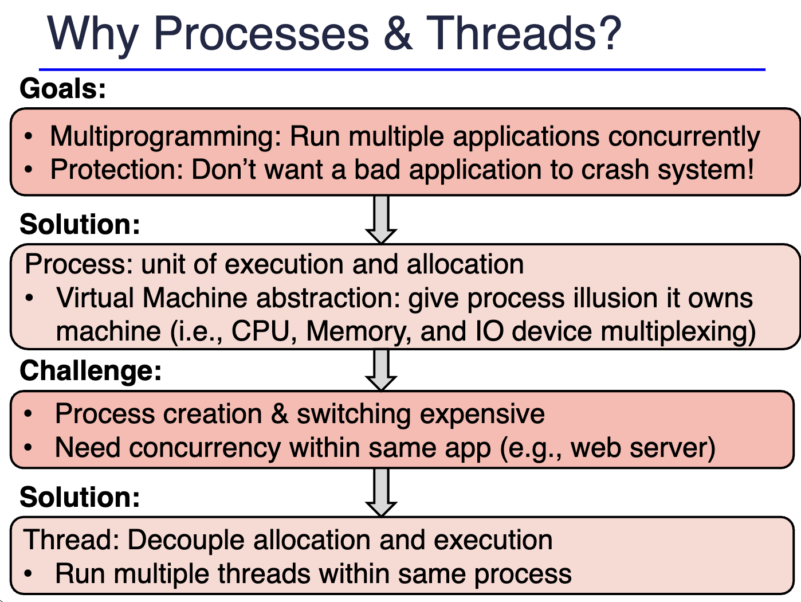

# 0312

[Lecture Note 3](../lecture-notes/03-process.pdf)

## Review

- we need beyond concept of program -> here's comes **process** in
  - process includes the notion of execution/allocation
- running program -> change the state of app.
- process is good for protection, but bad performance
  - introducing **thread**. smaller concept.

## Process & Thread

- protection <-> efficiency: tradeoff
- process switch overhead
  - very high (CPU is low, but memory/IO is high)
- also, sharing overhead - high
  - not good for collaboration

### Multithreaded process

- each thread can have own execution environment (e.g. registers, stacks.)
- thread can share the resources, so collaborate very easily
- thread switch overhead -> low. b/c cpu state switching is low.

### Structure

- now, we have **thread** concept, do we need more mechanical support for this new concept?
- what is *private* to each thread?
  - CPU states.
  - Store thread info in Thread Control Block (TCB)
- e.g. execution stack
  - go to func A -> A: (tmp = 1 /ret = addrZ) stored in stack (see picture in 03/12)
  - execute body of A. tmp = 1, another function call B
  - create another stack entry for B (ret = addrY)
  - inside body of B, new function call, new stack entry again for C (ret = addrU)
  - inside body of C, new function call for A. create another stack entry for A. (tmp = 2  ret = addrV)
    - stack keeps grow... even if entry for A already exists
  - again, inside A. how do we know tmp? -> watch last stack pointer(SP)
  - as tmp = 2 -> printf(2).
  - finish A -> ret to addrV, stack entry remove -> ret to addrU -> ret to addrY -> printf(1). -> ret to addrZ
- in process address space structure
  - pc -> multiple pointer, but code just need only one.
  - sp -> multiple pointer, and segment should be spatially separated.
  - heap -> can be (de)allocated dynamically.

- Is it safe to share all memory in one application, by thread?
  - NO! as we don't write all code by ourselves.
  - use library for some ad, that thread can look at all the memory of the process
  - **we need some idea to solve this issue**
    - multi-process architecture. (e.g. Browser)
    - but.. what if we really need to deal with this problem in single process?

### Thread Management

- who takes care? -> kernel vs user-level

#### kernel-level threads

- syscall-base.

#### user-level threads

- library takes care of thread creation/management/scheduling/context switch
- more efficient b/c function call (cheaper than syscall)

#### threading models

- Many-To-One: green -> only- user mode, so portable for other OS
  - not fully implemented on multiprocessors
  - Java was first this, but later migrated to one-to-one

---

[Lecture Note 4](../lecture-notes/04-scheduling.pdf)

- design principle -> not only **abstraction**, but only **separation** btw policy and mechanism
  - if we use hard-coded policies -> it's like traditional physical keys for hotel.