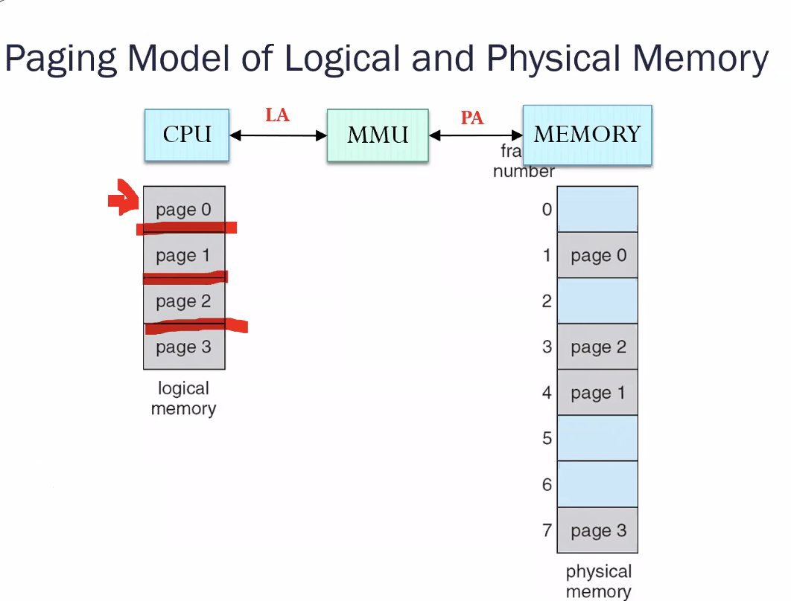

# 0421

[Lecture Note 7](../lecture-notes/07-memory-management.pdf)

- process believes it has its own memory portion = logical address (logical space)
- mmu: for address translation
- problem: fragmentation
  - all process requires same memory size -> no fragmentation!
  - external fragmentation: 공간은 있지만, contiguous하지 않기 때문에 메모리 배당이 안 되는 케이스
- memory management by **paging**

## Paging

- divide logical memory into same size (page 0 ~ N)
- page table: page index -> physical frame index
  - mmu translates
- if 1 page = 1 KB then we need **10** bits to denote the address inside the page
- 22 bit (page number) + 10 bit (page offset)
- where is the page table? -> kernel area
  
## EAT (Effective Access Time)

- EAT = (1 + e) * a + (2 + e) * (1 - a) = 2 + e - a
- epsilon = 10% of memory access time in real time.
- in reality very high TLB hit ratio(~= 0.999). 10% overhead for memory access!!

## Page table again

- what if we swap out page table?
  - the whole address translation cannot work correctly
- we need to keep page table in physical memory.
- 32 bit address space for 4kb page = 2^20 entry * 4 B = 4 MB
- 48 bit address space for 4kb page = 2^36 entry * 4 B = 256 GB
  - too big!
  - we don't have physical memory as large as this one.
  - other approaches...!

### 1. Hierarchical Paging

- multiple layers of page table.
- outer page table -> indicates which page table is allocated in physical memory and where.
  - divige page numer space into two.
- **sparse**! some page may not be used!

### 2. Hashed Page Tables

- apply hash to page number
- conflict -> manage list
- how big hash table is?
  - depending on the hash function.

### 3. Inverted Page Table

- page table contains page number instead of frame number.
- frame number = index of the page table.
- logical address contain pid, page number, offset
- lookup for pid || page number
- which frame contains which page of which process
- advantage in space but disadv in time.

---

[Lecture Note 8](../lecture-notes/08-virtual-memory.pdf)

## Virtual Memory

- previous: we lookuped contiguous allocation & paging
  - paging: reduce fragmentation problem.
  - also logical address space can be much larger
  - also some spaces can be shared

### Demand Paging

- load memory only when it is needed (accessed).
- each entry in page table -> store information: valid-invalid bit
  - whether this page is loaded into physical memory.
- what if a process wants to access the invalid page -> page fault!
  
### Page Fault

- mmu will raise a trap
- OS will look internal table (PCB)
  - invalid reference = abort
  - just not in memory. -> page fault handling
    - get empty frame
    - swap target page from the storage to the empty frame
    - reset page tables (change v-invalid bit to valid)
    - restart instruction that caused page fault.

### EAT

- p = page fault ratio
- EAT = (1 - p) * memory access + p * (page fault overhead + memory access)
- page fault overhead = swap page out + swap page in + restart
- locality is the key to reduce overhead!