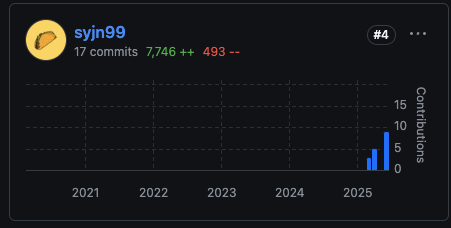

# CS420 - Compiler Design (A0)

> Instructor: Jeehoon Kang

**Build my own C compiler with Rust**. The lecture mostly introduces de facto techniques for compiler engineering (mostly inspired from LLVM architecture). All [lectures](https://github.com/kaist-cp/cs420) and project code([`kecc-public`](https://github.com/kaist-cp/kecc-public)) are public.

## Features

- Writing **7000+ LOC** in Rust to build a compiler.
- As a [parser](https://github.com/vickenty/lang-c) is given, students are responsible to generate the assembly code from AST (Abstract Syntax Tree). 
- IR (Intermediate Representation) is a crucial for optimization along with SSA (Single Static Assignment) property of registers.

## What I learnt

- Amazing lecture and well-prepared project: This course doesn't teach how to evaluate existing compilers, it rather tries to internalize the compiler and its optimization by building my "own" working compiler. IR is well-designed: it looks similar to LLVM IR (which is good for referring LLVM articles) while simple enough to handle in one-semester-length course. I also learned a basic concept of AI compiler, and realized that compilers share common architectures each other. (though the optimizations are very different by targets)
- Rust experience: I appreciate the instructor to choose Rust as a main language in this course. 
- Because of the time constraint, it's such a shame I couldn't spend much time for optimizing my compiler. My compiler focuses on generating a valid RISC-V assembly code, so most of the variables in a target function are spilled in the stack which is WAY TOO INEFFICIENT.
