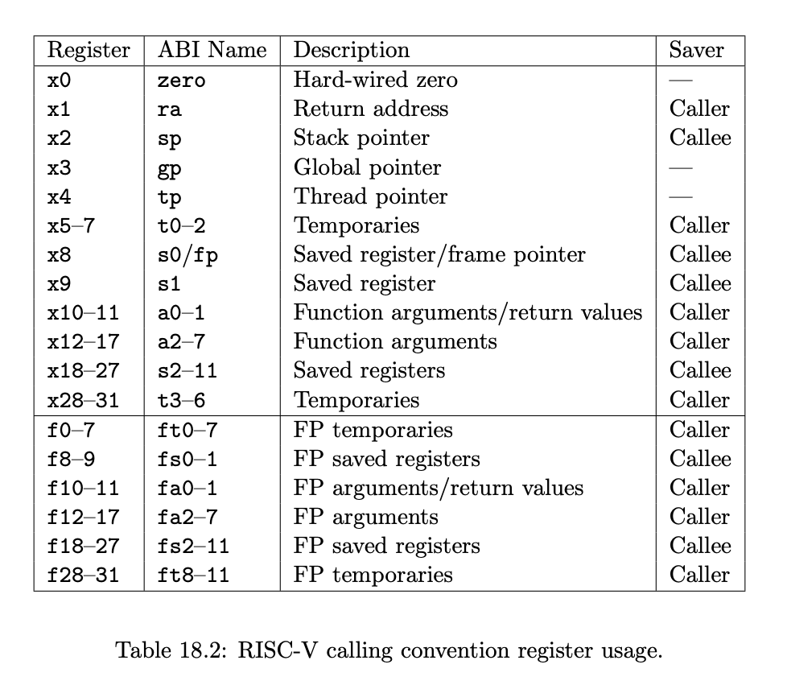

# 0422

- p93 RISC-V Assembly

- ISA: contract(or interface) btw software and hardware
  - not a sole result of one discussion -> tradeoff...
  - **narrow** interface: do not provide too many methods
    - curated set of instr
  - **deep** interface: yet provide large # of instrs
    - efficiently utilize HW using ISA
- Why RISC-V
  - RISC -> reduce, must be simple
  - but ARM -> very complex 1000s pages
  - RISC-V -> manual: 100s pages

- why calling convetion
  - b/c another programs not built by me.
  - calling convention is not unique.
  - different OS has different calling convetion
    - e.g. x86_64 for Linux vs. Windows
  - https://stackoverflow.com/questions/65864046/why-make-some-registers-caller-saved-and-others-callee-saved-why-not-make-the-c

- RISC-V
  - nowadays CPU is not consuming energy a lot. (GPU energy efficiency is more important)
  - so not favor in server market, x86 quite well optimized.
- current server market
  - cf1. RAG: Retrieval Augmented Generation, GB200
  - cf2. Mellanox acquisition by Nvidia