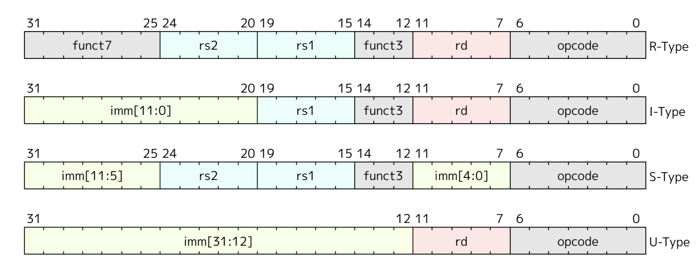

# 0429

## Calling convention in RISC-V

https://riscv.org/wp-content/uploads/2024/12/riscv-calling.pdf

- soft-float
- x87 -> x86 + floating point accelerator 
  - nowadays, x87 completely merged to x86
- RISC-V -> modular architecture. 
  - one of ISA is for integer only: small embedded system.

See also [manual](../resources/riscv-asm.pdf)
- rv64i: base (i for integer)
- m: multiplication
- and so on
- If there's no example a lot, consult reference manual.

## AsmGen (codegen)

https://drive.google.com/file/d/1uviu1nH-tScFfgrovvFCrj7Omv8tFtkp/view

- R-type?: two registers, destination register, can represent addition, mul...
- I-type: single source register with immediate value. e.g. jump offset
- S-type: no destination register. e.g. store. 
- why opcode position same?
  - in CPU impl -> decodes instr word -> helpful for reducing communication

- aspects
  - instruction selection: translate phinode -> into mv instruction. so phinode compling into nothing.
  - instruction scheduling
    - https://developcamp.tistory.com/49
    - out-of-order processor won! (vs VLIW)
    - instruction window: 200 -> execute 200 instr in parallel
    - (cf) task unit for AI accelerator -> like VLIW
  - register allocation: spill values into stack when not enough physical memory
