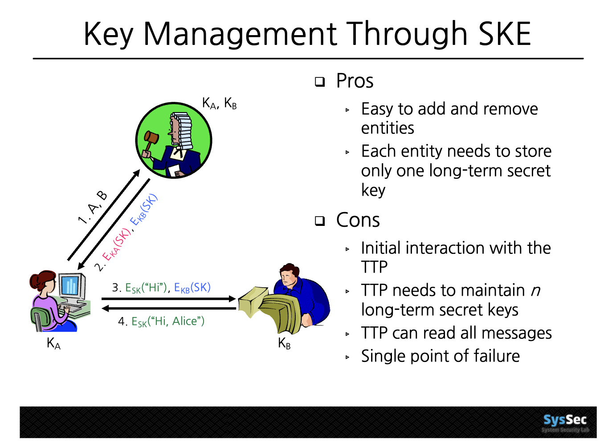

# 0319

[Lecture Note 3](../lecture-notes/Lec3.pdf) from Digital Signatures

## Digital Signatures

- Hand signature -> no public verifiability.
  - forgeability
  - no binding btw message and signature.
- digital signature
  - public verifiability
  - message integrity
  - unforgeability
- Prevent MitM(Man in the Middle) attack
  - There is some trusted third party (TTP) (e.g. Verisign, other certificate vendors)
    - this party MUST BE TRUSTED...
  - public key certificate(~= 공인인증서)
  - Bob sends message, and s^* (signed) -> verify s^* with the trusted third party public key that Bob's pubkey is really from Bob.

## Hash function

- security -> depends on how much computing power presents..
  - e.g. Bitcoin mining
- (cf) quantum computing
  - we need "accurate" quantum computing, not "approximate".
  - quantum computing will not change the world in terms of security.
  - PQC (Post-Quantum Cryptography)
- MAC: both authentication and integrity
  - family of hash functions
  - similar to digital signature, but MAC has **symmetricity**.

## Authentication

- 1. Using HMAC: Replay attack -> include timestamp (provide freshness)
  - but this should be based on synchronized timer...!!
- 2. Using Digital Signature
- 3. Here comes in ZKP -> multiple properties (inequality, equality...)
  
- using symmetric key -> can they communicate secure where Alice and Bob never met before?

## Key Management

- = a whole lifecycle of a key.

- using SKE (TTP) -> `Kerberos` (invented at 1980, included in Windows/Linux)
  - TTP = single point of failure, single point of attack
- using PKE -> next time.